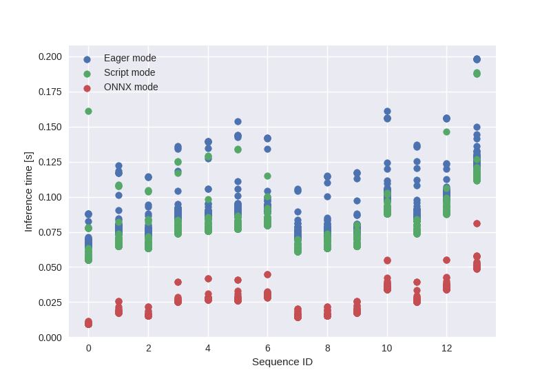
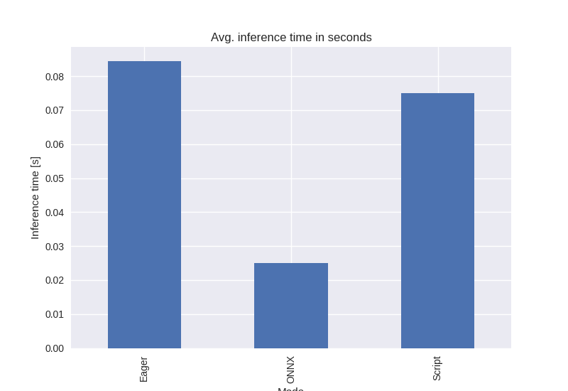

# Hugging Torch

I wanted to explore different ways to optimize PyTorch models for inference, so I played a little bit with TorchScript, ONNX Runtime and classic PyTorch eager-mode to compare their performance. I use pre-trained RoBERTa model (trained for sentiment analysis from tweets) along with BERT tokenizer. Both models are hosted by HuggingFace.

I wrote 14 different text sequences (7 with positive and 7 with negative sentiments) with different lengths and I used them for model inference. To obtain more reliable results, I repeated that process 1000 times (1000 times x 14 sequences = 14K runs for single model configuration).

### Results

